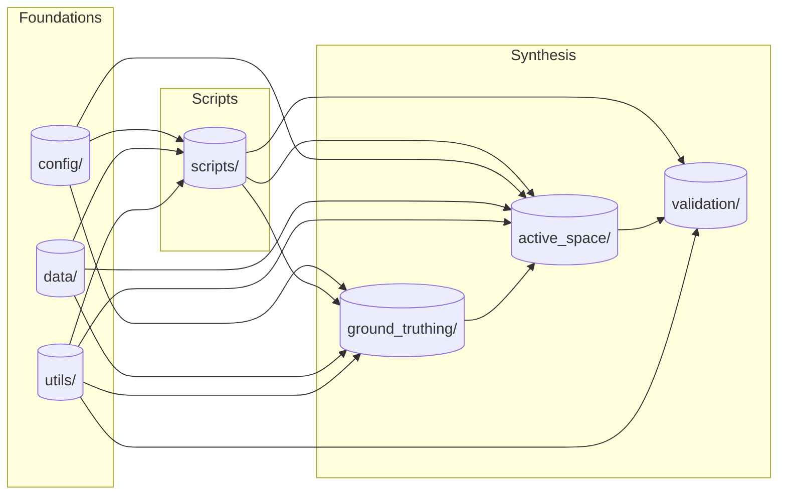

[](https://doi.org/10.5281/zenodo.18111579)

# NPS-ActiveSpace

An **_active space_** is a well-known sensory concept from bioacoustics ([Marten and Marler 1977](https://www.jstor.org/stable/pdf/4599136.pdf), [Gabriele et al. 2018](https://www.frontiersin.org/articles/10.3389/fmars.2018.00270/full)). It represents a geographic volume whose radii correspond to the limit of audibility for a specific signal in each direction. In other words, an active space provides an answer to the question, _"how far can you hear a certain sound source from a specific location on the Earth's surface?"_

This repository is designed to estimate active spaces for motorized noise sources transiting the U.S. National Park System. Aircraft are powerful noise sources audible over vast areas. Thus [considerable NPS management efforts have focused on protecting natural quietude from aviation noise intrusions](https://www.nps.gov/subjects/sound/overflights.htm). For coastal parks, vessels are similarly powerful noise sources of concern. For both transportation modalities `NPS-ActiveSpace` provides meaningful, quantitative spatial guides for noise mitigation and subsequent monitoring.

## Example

Consider an example active space, below. It was computed using data from a long term acoustic monitoring site in Denali National Park, DENAUWBT Upper West Branch Toklat ([Withers 2012](https://irma.nps.gov/DataStore/Reference/Profile/2184396)). The bold black polygon delineates an active space estimate for flights at 3000 meters altitude. Points interior to the polygon are predicted to be audible, those exterior, inaudible. <br>

Superposed over the polygon are colored flight track polylines. `NPS-ActiveSpace` includes an application that leverages the acoustic record to ground-truth audibility of co-variate vehicle tracks from GPS databases. Ground-truthing is used to "tune" an active space to the appropriate geographic extent via mathematical optimization.<br>

<br>


### Synthesis-oriented Design

At its heart, `nps_active_space` is organized around the idea of a **scientific geo-synthesis**:
a structured combination of heterogeneous spatial observations into a single, interpretable
geometric object.

Rather than treating sound propagation, audibility, and vehicle movement as
independent modeling problems, the toolkit treats them as *causally linked
components* of an observer-centered system:

- Vehicle trajectories represent potential causes
- Acoustic records represent observed effects
- Audibility is established through empirical association
- Geometry is used to reconcile these relationships in space

The resulting active space is not a purely predictive construct, nor a purely
descriptive one. It is a **mensurated estimate**: a spatial enclosure that is
consistent with observed audibility under specified environmental conditions.

## Installation

The repository has been tested with Python 3.12. Runtime dependencies are declared in `pyproject.toml` and installed automatically by pip (except GDAL on macOS/Linux, which requires a system library first).

Clone the repository, then follow the steps for your platform. The clone includes [`example_data/`](example_data/) (~75 MB) for local development and tests — see [`example_data/README.md`](example_data/README.md).

```bash
git clone https://github.com/dbetchkal/NPS-ActiveSpace.git
cd NPS-ActiveSpace
```

### Windows

GDAL is installed automatically from a pre-built wheel in `pyproject.toml`.

```bat
python -m venv .venv
.venv\Scripts\activate.bat
python -m pip install --upgrade pip
pip install -e ".[dev]"
```

> **Ground-truthing GUI:** `run_ground_truthing.py` uses tkinter. Include "tcl/tk and IDLE" when installing from [python.org](https://www.python.org/downloads/). Verify with `python -c "import tkinter; print('ok')"`.

### macOS / Linux

Install [GDAL](https://gdal.org/en/stable/) as a system library first, then match the Python binding:

```bash
# macOS (Homebrew)
brew install gdal

# Linux (Debian/Ubuntu)
sudo apt-get install gdal-bin libgdal-dev
```

> **Ground-truthing GUI:** also install tkinter — macOS: `brew install python-tk@3.12` · Linux: `sudo apt-get install python3.12-tk`

```bash
python3.12 -m venv .venv
source .venv/bin/activate
python -m pip install --upgrade pip
GDAL_VERSION=$(gdal-config --version)
pip install "GDAL==${GDAL_VERSION}"
pip install -e ".[dev]"
```

**Using without a clone:** you can install directly from GitHub with `pip install "NPS-ActiveSpace @ git+https://github.com/dbetchkal/NPS-ActiveSpace.git"` (on macOS/Linux, complete the GDAL steps above first). Config files go in the installed package's `config/` directory — find it with `python -c "import nps_active_space, os; print(os.path.join(nps_active_space.ACTIVE_SPACE_DIR, 'config'))"`. Run scripts from outside the repo so Python uses the installed package, not a local checkout.

---

### Running scripts

Scripts are run as Python modules from the repository root:

```bash
python -m nps_active_space.scripts.run_ground_truthing -e production -u DENA -s MOOS -y 2018
```

See [`nps_active_space/scripts/README.md`](nps_active_space/scripts/README.md) for the full list of scripts and their arguments.

**Verify the install:**

```bash
python -c "import nps_active_space, geopandas, rasterio, iyore; print('NPS-ActiveSpace OK')"
```

### NMSIM (active space generation)

Active space generation runs the NMSIM Nord2000 physics model as an external process. NMSIM is **not** installed by pip and is **not** included in this repository. Obtain the binary + required files separately (feel free to reach out to NPS-ActiveSpace maintainers) and set the path in your config:

```text
[project]
nmsim = C:\path\to\Nord2000batch.exe
```

Required for `generate_active_space.py`, `generate_3d_active_space.py`, and `generate_active_space_mesh.py`. **Not** required for ground-truthing, audible transits, or validation.

### Configuration

All scripts require a configuration file named `<environment>.config` (e.g. `DENA.config`, `HAVO.config`). Copy [`nps_active_space/config/template.config`](nps_active_space/config/template.config), fill in the values for your deployment, and save it to `nps_active_space/config/`.

## Toolkit Architecture



### The Synthesis

At its heart, this toolkit structures a **scientific geo-synthesis** in two parts:

1) A GUI-based audibility measurement tool (`.ground_truthing`) that allows users to spatio-temporally $\text{JOIN}$ vehicle tracks (cause) and acoustic records (effect).
2) A geoprocess to $\text{ENCLOSE}$ the listening location and a user's audibility observations within an optimal 3-dimensional active space (`.active_space`).

This enables a causal geometric calculation (mensuration) of acoustic metrics. Tools to help validate a set of syntheses are provided (`.validation`).

### Scripted Control

The entire synthesis $\rightarrow$ validation $\rightarrow$ mensuration workflow is scripted in a Command Line Interface (`.scripts`). For more information on scripted control, see the detailed [control script documentation](https://github.com/dbetchkal/NPS-ActiveSpace/tree/main/nps_active_space/scripts#scripts).

### Foundations

To enable environmental scenario planning, global repository inputs are all structured together in a configuration file (`.config`) that spans the architecture. Utilities implement both data structure models and diverse computation tasks (`.utils`) that are used throughout the architecture. 

The toolkit also requires basic sound source and weather profile data to operate. The provided (`.data`) are a widely applicable example: a fixed-wing propeller aircraft source and a standard "acoustician's atmosphere" with dry adiabatic lapse conditions. The toolkit may be run using alternative, custom sound sources or weather profiles. 

### Data and File Directory Setup

#### `NMSIM` project directory setup:

The `.config` configuration file requires a *project directory*, which may contain many listening locations (sites), which in turn can be configured flexibly to produce test many scenarios. The toolkit expects the user's project directory to be structured as follows:

```bash
project_directory/
├── UNITSITE_A/
│   ├── UNITSITE_A_study_area.shp
│   ├── Input_Data/
│   │   ├── 01_ELEVATION/
│   │   └── 02_IMPEDANCE/
│   │   └── 05_SITES/
│   └── Output_Data/
│       ├── ASCII/
│       ├── AUDIBLE_TRANSITS/
│       ├── IMAGES/
│       ├── SITE/
│       └── TIG_TIS/
├── UNITSITE_B/
│   ├── UNITSITE_B_study_area.shp
│   └── ...
└── ...
```

As an observer-based audibility model, each `nps_active_space` site directory (above `UNITSITE_A, UNITSITE_B, ...`) corresponds with a physical **listening location** on Earth. The files composing each site directory amount to a geographic model of a listener with no audible sound source present—only the quiescent surrounding land surface. Such a geographic model is a required input for every possible `nps_active_space` configuration scenario. 

##### Within the root of the project directory:

The overarching input of `nps_active_space` is a study area. It is a required input. It must be contained within the root project directory and named similar to `UNITSITE_study_area.shp` (ESRI shapefile), where the variable geographic prefix `UNITSITE` matches the name of the project directory. It is recommended that study area geometries are saved using `NMSIM`'s native coordinate reference system (crs), NAD83 GCS North American (EPSG:4269).

After their creation, the annotation outputs of `.ground_truthing` (.geojson) also belong in the root of the project directory. Clock drift correction files produced via [the `.utils\clock_drift.py` utility](https://github.com/dbetchkal/NPS-ActiveSpace/blob/main/nps_active_space/utils/clock_drift.py) also belong in the root of the project directory.

##### Within `01_ELEVATION`:

Terrain within the geographic model is represented by a portion of [the National Elevation Dataset (Gesch, 2002)](https://apps.nationalmap.gov/downloader/). It is a required input. It must be formatted as ESRI grid-float (*.flt*) and stored in the `01_ELEVATION` subdirectory. 

##### Within `02_IMPEDANCE`:

Landcover-related variability in acoustic impedance along the propagation path is represented by a portion of [the National Landcover Dataset (NLCD; Yang , 2018)](https://apps.nationalmap.gov/downloader/). It is an optional input. Like elevation data, flow resistivity data should also be formatted as ESRI grid-float (*.flt*) for use with `NMSIM`. Each landcover category may be coasrely mapped to a corresponding value of flow resistivity ($\frac{Pa \ s}{m^2} = \frac{kg}{m^3 \ s}$) following the guidelines of Table I (<a href="https://doi.org/10.1121/10.0030300">adapted</a> from Ikelheimer and Plotkin, 2005b; Embleton, 1996b; Plovsing and Kragh, 2001).

<table>
  <caption>
    <strong>Table I.</strong> NLCD class mapped to flow resistivity value.
  </caption>
  <thead>
    <tr>
      <th>NLCD Class</th>
      <th>Description</th>
      <th>Flow Resistivity ($\frac{Pa \ s}{m^2}$)</th>
    </tr>
  </thead>
  <tbody>
    <tr>
      <td>11</td>
      <td>Open water</td>
      <td>100&nbsp;000</td>
    </tr>
    <tr>
      <td>21</td>
      <td>Developed, open space</td>
      <td>200</td>
    </tr>
    <tr>
      <td>22</td>
      <td>Developed, low intensity</td>
      <td>300</td>
    </tr>
    <tr>
      <td>23</td>
      <td>Developed, medium intensity</td>
      <td>5&nbsp;000</td>
    </tr>
    <tr>
      <td>24</td>
      <td>Developed, high intensity</td>
      <td>10&nbsp;000</td>
    </tr>
    <tr>
      <td>31</td>
      <td>Barren (e.g., bedrock, talus)</td>
      <td>100&nbsp;000</td>
    </tr>
    <tr>
      <td>41</td>
      <td>Deciduous forest</td>
      <td>70</td>
    </tr>
    <tr>
      <td>42</td>
      <td>Evergreen forest</td>
      <td>70</td>
    </tr>
    <tr>
      <td>43</td>
      <td>Mixed forest</td>
      <td>70</td>
    </tr>
    <tr>
      <td>51</td>
      <td>Dwarf scrub</td>
      <td>200</td>
    </tr>
    <tr>
      <td>52</td>
      <td>Shrub/scrub</td>
      <td>200</td>
    </tr>
    <tr>
      <td>90</td>
      <td>Woody wetlands</td>
      <td>100&nbsp;000</td>
    </tr>
  </tbody>
</table>

##### Within `05_SITES`:

Any three-dimensional coordinate above Earth's surface may be used as a listener location. The listener location should be formatted as a `NMSIM` (*.sit*) file and stored in the `05_SITES` subdirectory.

## Intended Use & Status

`nps_active_space` is intended for **observer-based, post hoc audibility analysis** of transportation noise using simultaneously collected, long-term acoustic records and covariate vehicle tracking data. It is designed to support scientific research, environmental assessment, and resource management applications, particularly in large, heterogeneous landscapes such as U.S. National Parks.

The toolkit is especially suited to problems where:

- A fixed listening location (or small set of locations) is monitored over time
- Sound sources are mobile (e.g., aircraft, vessels, overland vehicles)
- Spatial questions are central (e.g., *where* is a source audible from, and *for how long?*)

`nps_active_space` is **not** a real-time noise monitoring system, nor a general-purpose
sound propagation model. It is a synthesis-oriented toolkit that combines
observations, geometry, and physical modeling to estimate spatial limits of
audibility under specified environmental conditions.

### Project Status

This software is:

- Research-grade and actively used in peer-reviewed studies
- Designed for transparency, reproducibility, and extensibility
- Under continued development as methods and use cases evolve

Interfaces and workflows may change as new synthesis pathways are added. Users are encouraged to treat outputs as **scientific estimates** whose validity depends on data quality, configuration choices, and underlying assumptions.

---

## License

### Public domain

This project is in the worldwide [public domain](LICENSE.md):

> This project is in the public domain within the United States,
> and copyright and related rights in the work worldwide are waived through the
> [CC0 1.0 Universal public domain dedication](https://creativecommons.org/publicdomain/zero/1.0/).
>
> All contributions to this project will be released under the CC0 dedication.
> By submitting a pull request, you are agreeing to comply with this waiver of copyright interest.

## Publications

The original technical paper (supporting the v1.0.0 Release):
> Betchkal, D.H., J.A. Beeco, S.J. Anderson, B.A. Peterson, and D. Joyce. 2023. Using Aircraft Tracking Data to Estimate the Geographic Scope of Noise Impacts from Low-Level Overflights Above Parks and Protected Areas. Journal of Environmental Management 348(15): 119201 https://doi.org/10.1016/j.jenvman.2023.119201 <br><br>

Validation on jet aircraft source types (v2.1.0 Release):
> Gurung, B., Betchkal, D.H., Beeco, J.A., Peterson, B.A., Olstad, T.A., Anderson, S., Hutchinson, S., Jackson, S. and Joyce, D., 2026. Estimating Active Space Noise Extent from Two Aircraft Weight Classes over the Great Smoky Mountains National Park. Aerospace, 13(4), p.363. https://doi.org/10.3390/aerospace13040363 <br><br>

A testing presentation (supporting the v3.0.0 Release):
> Kosinski, A. and Betchkal, D. H. 2025. Reliability of the 3D Active Space Model. U.S. National Park Service. https://irma.nps.gov/DataStore/Reference/Profile/2316524 <br>


Management papers using `NPS-ActiveSpace`:
> Peterson, B.A., Coffey, L., Gurung, B., Hutchinson, J.S., Olstad, T.A., Betchkal, D.H., Anderson, S.J., Joyce, D. and Beeco, J.A., 2025. Understanding Overflight Travel Patterns Above Parks and Protected Areas: A Systematic Review. Journal of Park and Recreation Administration. https://doi.org/10.18666/JPRA-2025-13120 <br><br>
> Ferguson, L.A., Peterson, B.A., Crump, M., Taff, B.D., Newman, P., Betchkal, D.H., Hutchinson, J.S. and Beeco, J.A., 2025. Integrating aircraft tracking, acoustic data, and surveys to evaluate park aircraft noise. Tourism Geographies, pp.1-20. https://doi.org/10.1080/14616688.2025.2591832 <br><br>

