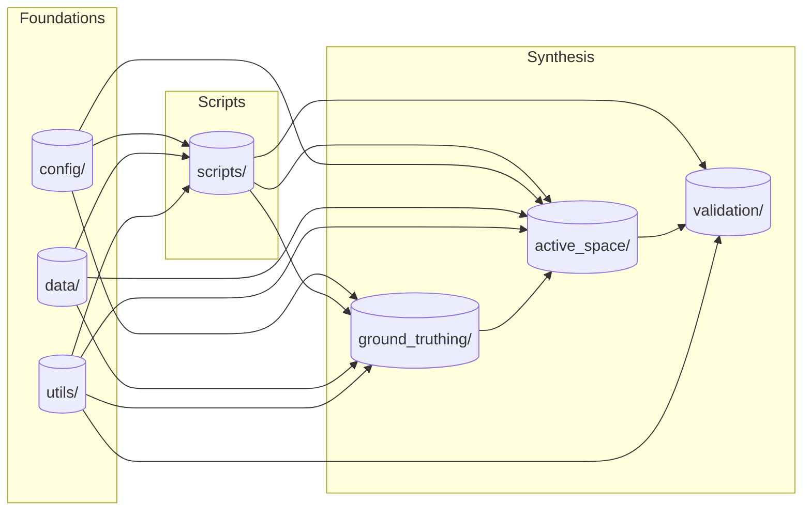

[](https://doi.org/10.5281/zenodo.18111579)

# NPS-ActiveSpace

An **_active space_** is a well-known sensory concept from bioacoustics ([Marten and Marler 1977](https://www.jstor.org/stable/pdf/4599136.pdf), [Gabriele et al. 2018](https://www.frontiersin.org/articles/10.3389/fmars.2018.00270/full)). It represents a geographic volume whose radii correspond to the limit of audibility for a specific signal in each direction. In other words, an active space provides an answer to the question, _"how far can you hear a certain sound source from a specific location on the Earth's surface?"_

This repository is designed to estimate active spaces for motorized noise sources transiting the U.S. National Park System. Aircraft are powerful noise sources audible over vast areas. Thus [considerable NPS management efforts have focused on protecting natural quietude from aviation noise intrusions](https://www.nps.gov/subjects/sound/overflights.htm). For coastal parks, vessels are similarly powerful noise sources of concern. For both transportation modalities `NPS-ActiveSpace` provides meaningful, quantitative spatial guides for noise mitigation and subsequent monitoring.

## Table of contents

- [Example](#example)
  - [Synthesis-oriented Design](#synthesis-oriented-design)
- [Installation](#installation)
  - [Step 1: Clone the NPS-ActiveSpace repository](#step-1-clone-the-nps-activespace-repository)
  - [Step 2: Set Up a Virtual Environment](#step-2-set-up-a-virtual-environment)
  - [Step 3: Install NPS-ActiveSpace](#step-3-install-nps-activespace)
  - [Step 4: Command-line tools](#step-4-command-line-tools)
  - [Step 5: Configuration](#step-5-configuration)
  - [Running tests](#running-tests)
- [Toolkit Architecture](#toolkit-architecture)
  - [The Synthesis](#the-synthesis)
  - [Scripted Control](#scripted-control)
  - [Foundations](#foundations)
- [Intended Use & Status](#intended-use--status)
  - [Project Status](#project-status)
- [License](#license)
  - [Public domain](#public-domain)
- [Publications](#publications)

## Example

Consider an example active space, below. It was computed using data from a long term acoustic monitoring site in Denali National Park, DENAUWBT Upper West Branch Toklat ([Withers 2012](https://irma.nps.gov/DataStore/Reference/Profile/2184396)). The bold black polygon delineates an active space estimate for flights at 3000 meters altitude. Points interior to the polygon are predicted to be audible, those exterior, inaudible. <br>

Superposed over the polygon are colored flight track polylines. `NPS-ActiveSpace` includes an application that leverages the acoustic record to ground-truth audibility of co-variate vehicle tracks from GPS databases. Ground-truthing is used to "tune" an active space to the appropriate geographic extent via mathematical optimization.<br>

<br>


### Synthesis-oriented Design

At its heart, `nps_active_space` is organized around the idea of a **scientific geo-synthesis**:
a structured combination of heterogeneous spatial observations into a single, interpretable
geometric object.

Rather than treating sound propagation, audibility, and vehicle movement as
independent modeling problems, the toolkit treats them as *causally linked
components* of an observer-centered system:

- Vehicle trajectories represent potential causes
- Acoustic records represent observed effects
- Audibility is established through empirical association
- Geometry is used to reconcile these relationships in space

The resulting active space is not a purely predictive construct, nor a purely
descriptive one. It is a **mensurated estimate**: a spatial enclosure that is
consistent with observed audibility under specified environmental conditions.

## Installation

### Step 1: Clone the NPS-ActiveSpace repository.

```
git clone https://github.com/dbetchkal/NPS-ActiveSpace.git
cd NPS-ActiveSpace
```

### Step 2: Set Up a Virtual Environment.

This is tested with **Python 3.12**. The Windows GDAL wheel in `pyproject.toml` targets `cp312`; use a
different wheel URL if you change Python version.

With Conda:

```
conda create --name active python=3.12.12
conda activate active
```

With venv in a Windows Git Bash terminal:

```
python -m venv .venv
source .venv/Scripts/activate
```

With venv in a Windows Command Prompt terminal:

```
python -m venv .venv
.venv\Scripts\activate.bat
```

With venv on macOS or Linux:

```
python3.12 -m venv .venv
source .venv/bin/activate
```

### Step 3: Install NPS-ActiveSpace

From the repository root, with the virtual environment activated:

```
python -m pip install --upgrade pip
pip install -e .
python -c "from nps_active_space.active_space import ActiveSpaceGenerator"
nps-ground-truthing --help
```

Runtime dependencies are declared in `pyproject.toml` and installed with the package. On Windows, GDAL is installed from a [CGohlke wheel](https://github.com/cgohlke/geospatial-wheels/releases) declared there. If updating the Python version, update that wheel URL to match.

### Step 4: Command-line tools

| Command | Script |
|---------|--------|
| `nps-ground-truthing` | Ground-truthing GUI |
| `nps-audible-transits` | Transit prediction |
| `nps-generate-active-space` | 2D active space (NMSIM) |
| `nps-generate-active-space-batch` | Batch active space |
| `nps-generate-active-space-mesh` | Active space mesh |
| `nps-generate-3d-active-space` | 3D active space |
| `nps-fit-3d-active-space` | Fit 3D active space |
| `nps-acoustic-metrics` | Acoustic metrics |
| `nps-geographic-metrics` | Geographic metrics |
| `nps-plot-altitudes` | Altitude plots |
| `nps-viz` | Visualization |
| `nps-check-study-duration` | Study-duration robustness |
| `nps-init-config` | Create `{environment}.toml` from bundled template |

Module invocation: `python -m nps_active_space.scripts.<module_name>`. All modules require `-e <environment>` to load `<environment>.toml` from your config directory (Step 5). See [script documentation](https://github.com/dbetchkal/NPS-ActiveSpace/tree/main/src/nps_active_space/scripts#scripts) for all flags.

### Step 5: Configuration

Pipeline scripts take **`-e <name>`** to load `<name>.toml` from your config folder. After `pip install -e .`, run `nps-init-config -e <environment_name>` (e.g. `nps-init-config -e DENA`), edit paths
and credentials, then pass `-e <name>` to scripts.

**[Configuration guide](src/nps_active_space/config/README.md)** — TOML fields, required paths,
`NPS_ACTIVE_SPACE_CONFIG_DIR`, and NMSIM site directory layout.

### Running tests

After Step 3, from the repository root (with the virtual environment activated):

```
pip install -e ".[dev]"
pytest
```

Dev dependencies are declared in `pyproject.toml` under `[project.optional-dependencies]`.

## Toolkit Architecture



### The Synthesis

At its heart, this toolkit structures a **scientific geo-synthesis** in two parts:

1) A GUI-based audibility measurement tool (`.ground_truthing`) that allows users to spatio-temporally $\text{JOIN}$ vehicle tracks (cause) and acoustic records (effect).
2) A geoprocess to $\text{ENCLOSE}$ the listening location and a user's audibility observations within an optimal 3-dimensional active space (`.active_space`).

This enables a causal geometric calculation (mensuration) of acoustic metrics. Tools to help validate a set of syntheses are provided (`.validation`).

### Scripted Control

The entire synthesis $\rightarrow$ validation $\rightarrow$ mensuration workflow is scripted in a Command Line Interface (`.scripts`). Install registers `nps-*` commands (Step 4). For per-script flags, see [control script documentation](https://github.com/dbetchkal/NPS-ActiveSpace/tree/main/src/nps_active_space/scripts#scripts).

### Foundations

To enable environmental scenario planning, global inputs are grouped in environment **TOML** files (see **Step 5** and the [configuration guide](src/nps_active_space/config/README.md)). One file corresponds to a set of inputs (e.g. `DENA.toml` for Denali) and is selected with `-e` by scripts. Utilities implement both data structure models and diverse computation tasks (`.utils`) that are used throughout the architecture. 

The toolkit also requires basic sound source and weather profile data to operate. The provided (`.data`) are a widely applicable example: a fixed-wing propeller aircraft source and a standard "acoustician's atmosphere" with dry adiabatic lapse conditions. The toolkit may be run using alternative, custom sound sources or weather profiles. 

Bundled `data/` and ground-truthing GUI icons are included in the install via `pyproject.toml` `package-data` so non-editable `pip install` deployments receive them.

## Intended Use & Status

`nps_active_space` is intended for **observer-based, post hoc audibility analysis** of transportation noise using simultaneously collected, long-term acoustic records and covariate vehicle tracking data. It is designed to support scientific research, environmental assessment, and resource management applications, particularly in large, heterogeneous landscapes such as U.S. National Parks.

The toolkit is especially suited to problems where:

- A fixed listening location (or small set of locations) is monitored over time
- Sound sources are mobile (e.g., aircraft, vessels, overland vehicles)
- Spatial questions are central (e.g., *where* is a source audible from, and *for how long?*)

`nps_active_space` is **not** a real-time noise monitoring system, nor a general-purpose
sound propagation model. It is a synthesis-oriented toolkit that combines
observations, geometry, and physical modeling to estimate spatial limits of
audibility under specified environmental conditions.

### Project Status

This software is:

- Research-grade and actively used in peer-reviewed studies
- Designed for transparency, reproducibility, and extensibility
- Under continued development as methods and use cases evolve

Interfaces and workflows may change as new synthesis pathways are added. Users are encouraged to treat outputs as **scientific estimates** whose validity depends on data quality, configuration choices, and underlying assumptions.

---

## License

### Public domain

This project is in the worldwide [public domain](LICENSE.md):

> This project is in the public domain within the United States,
> and copyright and related rights in the work worldwide are waived through the
> [CC0 1.0 Universal public domain dedication](https://creativecommons.org/publicdomain/zero/1.0/).
>
> All contributions to this project will be released under the CC0 dedication.
> By submitting a pull request, you are agreeing to comply with this waiver of copyright interest.

## Publications

The original technical paper (supporting the v1.0.0 Release):
> Betchkal, D.H., J.A. Beeco, S.J. Anderson, B.A. Peterson, and D. Joyce. 2023. Using Aircraft Tracking Data to Estimate the Geographic Scope of Noise Impacts from Low-Level Overflights Above Parks and Protected Areas. Journal of Environmental Management 348(15): 119201 https://doi.org/10.1016/j.jenvman.2023.119201 <br><br>

Validation on jet aircraft source types (v2.1.0 Release):
> Gurung, B., Betchkal, D.H., Beeco, J.A., Peterson, B.A., Olstad, T.A., Anderson, S., Hutchinson, S., Jackson, S. and Joyce, D., 2026. Estimating Active Space Noise Extent from Two Aircraft Weight Classes over the Great Smoky Mountains National Park. Aerospace, 13(4), p.363. https://doi.org/10.3390/aerospace13040363 <br><br>

A testing presentation (supporting the v3.0.0 Release):
> Kosinski, A. and Betchkal, D. H. 2025. Reliability of the 3D Active Space Model. U.S. National Park Service. https://irma.nps.gov/DataStore/Reference/Profile/2316524 <br>


Management papers using `NPS-ActiveSpace`:
> Peterson, B.A., Coffey, L., Gurung, B., Hutchinson, J.S., Olstad, T.A., Betchkal, D.H., Anderson, S.J., Joyce, D. and Beeco, J.A., 2025. Understanding Overflight Travel Patterns Above Parks and Protected Areas: A Systematic Review. Journal of Park and Recreation Administration. https://doi.org/10.18666/JPRA-2025-13120 <br><br>
> Ferguson, L.A., Peterson, B.A., Crump, M., Taff, B.D., Newman, P., Betchkal, D.H., Hutchinson, J.S. and Beeco, J.A., 2025. Integrating aircraft tracking, acoustic data, and surveys to evaluate park aircraft noise. Tourism Geographies, pp.1-20. https://doi.org/10.1080/14616688.2025.2591832 <br><br>

