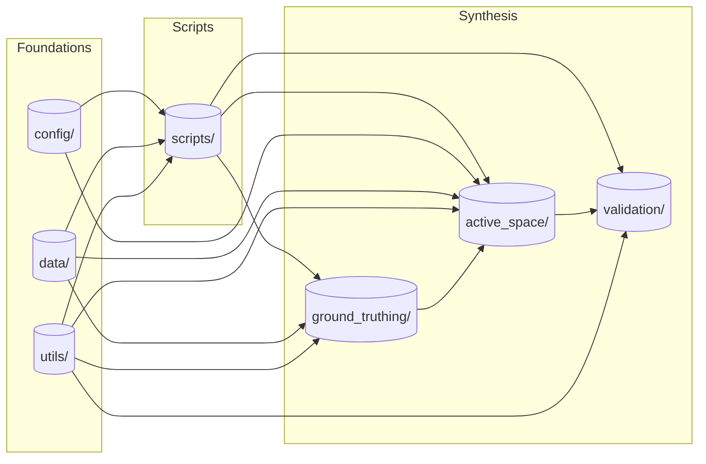

# NPS-ActiveSpace

## What is active space?

An **_active space_** is a well-known sensory concept from bioacoustics ([Marten and Marler 1977](https://www.jstor.org/stable/pdf/4599136.pdf), [Gabriele et al. 2018](https://www.frontiersin.org/articles/10.3389/fmars.2018.00270/full)). It represents a geographic volume whose radii correspond to the limit of audibility for a specific signal in each direction. In other words, an active space provides an answer to the question, _"how far can you hear a certain sound source from a specific location on the Earth's surface?"_

This repository is designed to estimate active spaces for motorized noise sources transiting the U.S. National Park System. Aircraft are powerful noise sources audible over vast areas. Thus [considerable NPS management efforts have focused on protecting natural quietude from aviation noise intrusions](https://www.nps.gov/subjects/sound/overflights.htm). For coastal parks, vessels are similarly powerful noise sources of concern. For both transportation modalities `NPS-ActiveSpace` provides meaningful, quantitative spatial guides for noise mitigation and subsequent monitoring.

## Example

Consider an example active space, below. It was computed using data from a long term acoustic monitoring site in Denali National Park, DENAUWBT Upper West Branch Toklat ([Withers 2012](https://irma.nps.gov/DataStore/Reference/Profile/2184396)). The bold black polygon delineates an active space estimate for flights at 3000 meters altitude. Points interior to the polygon are predicted to be audible, those exterior, inaudible.  

Superposed over the polygon are colored flight track polylines. `nps_active_space` includes an application that leverages the acoustic record to ground-truth audibility of co-variate vehicle tracks from GPS databases. Ground-truthing is used to "tune" an active space to the appropriate geographic extent via mathematical optimization. 

 

## Architecture

### The Synthesis

At it's heart, this repository structures a two-step **scientific synthesis**:

1) A GUI-based audibility measurement tool (`.ground_truthing`) to spatio-temporally $\text{JOIN}$ cause and effect.
2) A geoprocess to $\text{ENCLOSE}$ the listener and user observations within an optimal 3-dimensional active space (`.active_space`). 

A user progresses the synthesis using scripts (`.scripts`). A script tool is also provided to assist in the validation of syntheses (`.validate`). [Control script documentation](https://github.com/dbetchkal/NPS-ActiveSpace/tree/main/nps_active_space/scripts#scripts).

### Foundations

To enable scenario planning, global repository inputs are all structured together in a configuration file (`.config`).

Internally, the toolkit requires sound source and weather data to operate. Provided (`.data`) are a widely applicable example: a fixed-wing propeller aircraft source and a standard "acoustician's atmosphere" with dry adiabatic lapse conditions. Utilities implement both data structure models and diverse computation tasks (`.utils`).

### Scripted Control

### Synthesis Modules

### `ground_truthing`

The `ground_truthing` module provides a `tkinter`-based interactive GUI app for the annotation of georeferenced sound events. This module is the initial step of the process. Prerequesite to using this module is logging a simultaneous pair of datasets in the field: (1) a canonical Type-1 NPS acoustic record (`Nvspl`) and (2) a transportation dataset (`Adsb`, `Ais`, or generalized `Tracks`).

The module is initialized in the Command Line Interface (CLI). Detailed [CLI documentation is available to initialize the app](https://github.com/dbetchkal/NPS-ActiveSpace/tree/main/_DENA#ground-truthing) from a park-specific configuration file (see [`template.config`](https://github.com/dbetchkal/NPS-ActiveSpace/blob/main/_DENA/config/template.config)).

### `active_space`

The `active_space` module is a CLI implementation of observer-based audibility modelling procedures. It produces an active space estimate through synthesis. This module exists primarially as a wrapper for the `FORTRAN`-based physics engine `Nord2000` as implemented in `NMSIM`. Previously-saved `ground-truthing.Annotations` files are required as an input. Diverse spatial and sound source inputs are also required to stage the `NMSIM` simulation (see [Ikelheimer and Plotkin 2005](https://github.com/dbetchkal/NMSIM-Python/blob/main/NMSIM/Manual/NMSim%20Manual.pdf)).

Detailed [CLI documentation is available to configure a synthesis](https://github.com/dbetchkal/NPS-ActiveSpace/blob/main/_DENA/README.md#generate-active-space) of the optimal active space estimate for a park listener in a specific location.

### `validation` [Beta v.3.0.0]

---

# AFTER THIS NEEDS TO BE PEELED OUT INTO INDIVIDUAL MODULE-LEVEL README FILES

## audible-transits

The `audible-transits` module is a CLI geoprocess to construct the spatiotemporal intersections of a set of tracks with an active space. As part of the construction errant `Tracks` are removed and tabulated. Output `Tracks` are imbued with the information necessary to produce an audiblity time series.

Detailed [CLI documentation is available to initialize the construction](https://github.com/dbetchkal/NPS-ActiveSpace/tree/main/_DENA#audible-transits).

---

## generate-metrics [beta]

The `generate-metrics` module estimates what we hear. To do this, it collapses the set of `audible-transits` into a binary audibility sequence in time.
Then, from attributes of these _noise events_ (or dualistically, _noise-free intervals_) a variety of acoustical and spatial metrics may be computed.

At present, no CLI interface exists for `generate-metrics`. Instead it has been designed to be imported into a more flexible IDE.

---

## utils

The utilities module `utils` contains two sub-modules:

1. `computation` for tasks related to:

   - geoprocessing
     - `.build_src_point_mesh()`
     - `.climb_angle()`
     - `.coords_to_utm()`
     - `.create_overlapping_mesh()`
     - `.interpolate_spline()`
     - `.NMSIM_bbox_utm()`
     - `.project_raster()`
   - audibility
     - `.audibility_to_interval()`
     - `.ambience_from_nvspl()`
     - `.ambience_from_raster()`
     - `.contiguous_regions()`
   - detection statistics
     - `.calculate_duration_summary()`
     - `.compute_fbeta()`

2. and `models` containing classes which parse various forms of input data:
   - **Automatic Dependent Surveillance–Broadcast (ADS-B)** broacasts from aircraft
     - `.Adsb()`
     - `.EarlyAdsb()`
   - **Automatic Identification System (AIS)** broadcasts from ships
     - `.Ais()`
   - human **spectrogram annotations** from the `NPS-ActiveSpace.ground_truthing` module as
     - `.Annotations()`
   - descriptions of canonical NPS Type-1 acoustic monitoring **Deployments**
     - `.Microphone()`
   - an **acoustic record** as 1/3rd-octave band spectral sound levels from a Deployment
     - `.Nvspl()`
   - generalized
     - `.Tracks()`

Most users should not need to use `utils` directly, but the data parsing classes may have use to other transportation geography projects.

---

## License

### Public domain

This project is in the worldwide [public domain](LICENSE.md):

> This project is in the public domain within the United States,
> and copyright and related rights in the work worldwide are waived through the
> [CC0 1.0 Universal public domain dedication](https://creativecommons.org/publicdomain/zero/1.0/).
>
> All contributions to this project will be released under the CC0 dedication.
> By submitting a pull request, you are agreeing to comply with this waiver of copyright interest.

## Publications

Publications about `NPS-ActiveSpace`:

> Betchkal, D.H., J.A. Beeco, S.J. Anderson, B.A. Peterson, and D. Joyce. 2023. Using Aircraft Tracking Data to Estimate the Geographic Scope of Noise Impacts from Low-Level Overflights Above Parks and Protected Areas. Journal of Environmental Management 348(15): 119201 https://doi.org/10.1016/j.jenvman.2023.119201
