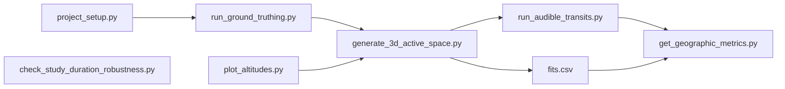
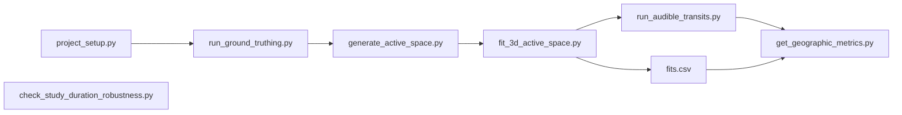
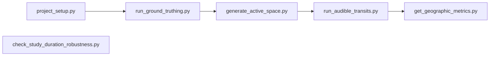
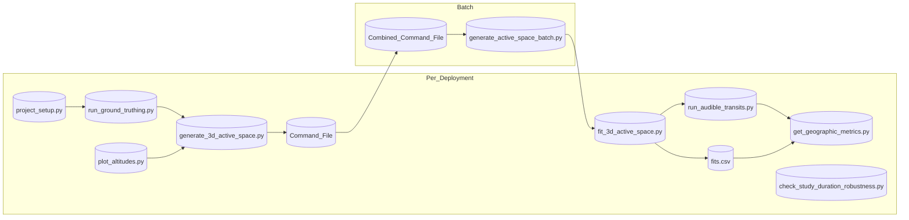
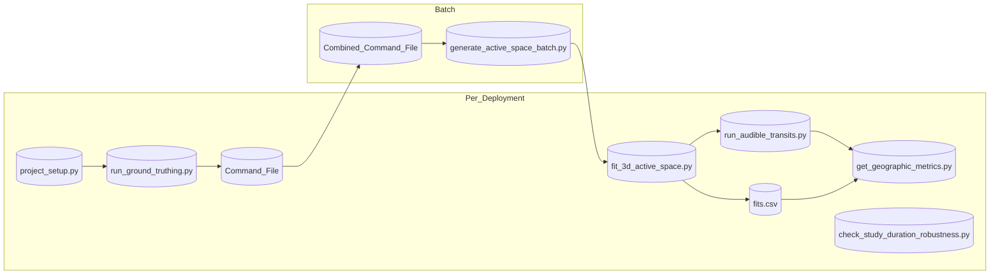

# Scripts

The `nps_active_space` [toolkit architecture](https://github.com/dbetchkal/NPS-ActiveSpace/tree/v3_docs?tab=readme-ov-file#toolkit-architecture) operates under the paradigm of scripted control: scripts advance various workflows.

This directory contains the scripts along with instruction for their use via a command line interface. See [below](#use-cases) for the most common use cases, and [further below](#script-usage) for detailed documentation of each script.

- [project_setup.py](#project-setup)
- [run_ground_truthing.py](#run-ground-truthing)
- [plot_altitudes.py](#plot-altitudes)
- [generate_3d_active_space.py](#generate-3d-active-space)
- [generate_active_space.py](#generate-active-space)
- [generate_active_space_batch.py](#generate-active-space-batch)
- [fit_3d_active_space.py](#fit-3d-active-space)
- [run_audible_transits.py](#run-audible-transits)
- [get_acoustic_metrics.py](#get-acoustic-metrics)
- [get_geographic_metrics.py](#get-geographic-metrics)
- [check_study_duration_robustness.py](#check-study-duration-robustness)
- [viz.py](#viz)

## Use Cases

### 3D Active Space

These are the steps for the **primary use case**: synthesizing a 3D active space $\rightarrow$ using it to predict acoustic metrics geographically.

1. Follow installation and data setup steps [here](https://github.com/dbetchkal/NPS-ActiveSpace/tree/v3_docs?tab=readme-ov-file#installation).
2. Use `run_ground_truthing.py` to annotate audible track segments. This GUI-based tool establishes a spatio-temporal $\text{JOIN}$ of vehicle positions (cause) and acoustic records (effect).
3. Use `plot_altitudes.py` to scope the altitudes spanned by aircraft traffic traversing the study area.
4. Use `generate_3d_active_space.py` to create a batch commands file based on the altitude range, generate active space layers, and fit the optimal gain. The fit results will be stored in `fits.csv` in the project directory.
5. Use `run_audible_transits.py` to predict audible transits based on the active space.
6. Use `get_geographic_metrics.py` to predict metrics based on audible transits.
7. [Optional] Annotate the acoustic record using the SPLAT software, then use `get_acoustic_metrics.py` to get the true acoustic metrics, and compare these with the predicted geographic metrics.
8. [Optional] Use `check_study_duration_robustness.py` to evaluate whether there was enough track data for a stable fit.



### 3D Visualization

Use `viz.py` to run the 3D visualization tool.

You can visualize:

- just the landscape/microphone position
- ground-truthed annotations
- a 3D active space (or a 2D active space if only one layer has been generated)
- audible transits
- any combination of the above

Make sure the data you want to visualize exist beforehand. The script won't look for data that it wasn't asked to visualize; for instance if you just finished setting up your data / directory structure, you can immediately visualize the landscape without needing to have ground-truthed tracks or generated an active space.

### 2D Active Space

1. Follow installation and data setup steps [here](https://github.com/dbetchkal/NPS-ActiveSpace/tree/v3_docs?tab=readme-ov-file#installation).
2. Use `run_ground_truthing.py` to annotate audible track segments.
3. Use `generate_active_space.py` to generate candidates for a single active space layer at a fixed altitude, and also fit the optimal gain.
4. We can make use of the 3D code to process a 2D active space, since a 2D active space is equivalent to a 3D one with a single layer. Make sure only a single layer of active spaces has been generated (check `../NMSIM_project_dir/Output_Data/ACTIVESPACES`). Then use `fit_3d_active_space.py` to fit the gain in a way the rest of the 3D code expects (storing it in the `fits.csv` file in the project directory). Then follow steps 5-6 of the typical 3D active space workflow.



Alternative: 2D audible transits supports more precise track clipping. If you want this, then use `run_audible_transits.py` with an argument specifying you're doing 2D, and then adapt `get_geographic_metrics.py` to use the correct 2D gain and 2D metadata for loading audible transits.



## Batch Generation

If you want to generate many active spaces at the same time, you can leverage the batch script to do so. This is useful for running it overnight or while you do other work.

### Batch 3D Active Space

1. Follow installation and data setup steps [here](https://github.com/dbetchkal/NPS-ActiveSpace/tree/v3_docs?tab=readme-ov-file#installation).
2. For each deployment:
   1. Use `run_ground_truthing.py` to annotate audible track segments.
   2. Use `plot_altitudes.py` to get a sense of the altitudes spanned by typical traffic.
   3. Use `generate_3d_active_space.py` with the `--only-prep` flag to automatically create a batch commands file based on the altitudes range, but not execute the commands.
3. Concatenate all the command files into one large text file.
4. Use `generate_active_space_batch.py` to execute the concatenated commands file.
5. For each deployment:
   1. Use `fit_3d_active_space.py` to fit the optimal gain. The fit results will be stored in `fits.csv` in the project directory.
   2. Complete steps 5-6 of the normal 3D active space workflow.
  


### Batch 2D Active Space

1. Follow installation and data setup steps [here](https://github.com/dbetchkal/NPS-ActiveSpace/tree/v3_docs?tab=readme-ov-file#installation).
2. For each deployment, use `run_ground_truthing.py` to annotate audible track segments.
3. Manually prepare a commands file containing the arguments for each run, see [below](#batch-commands-file-format).
4. Use `generate_active_space_batch.py` to execute the concatenated commands file.
5. For each deployment, complete step 4 of the normal 2D active space workflow.



# Script Usage


### Project Setup

This script initializes an `NPS-ActiveSpace` project, including a standard directory. Fundemental geospatial files are created as well.

| command-line arg        | description                                                                                                                                      |
| ----------------------- | ------------------------------------------------------------------------------------------------------------------------------------------------ |
| `-e`, `--environment`   | **required.**<br/>The configuration environment to use. _Ex_: To use `production.config` pass `-e production`                                    |
| `-u`, `--unit`          | **required.**<br/>The 4 letter NPS unit code. _Ex_: Glacier Bay = GLBA                                                                                |
| `-s`, `--site`          | **required.**<br/>The 4 letter site code. _Ex_: Willoughby Island SE = WILL                                                                                 |
| `-y`, `--year`          | **required.**<br/>The deployment year, YYYY. _Ex_: 2025                                                                                          |
| `--mic-coord` | **required.**<br/>The x,y coordinates of the listening location / microphone (in WGS84). _Ex_: -136.088360 58.569310 |
| `--studyarea-sw` | **required.**<br/>The x,y coordinates of the study area's southwest (lower left) corner (in WGS84). _Ex_: -136.088360 58.569310 |
| `--studyarea-ne` | **required.**<br/>The x,y coordinates of the study area's northeast (upper right) corner (in WGS84). _Ex_: -135.818994 58.706095 |

Example executions:

```bash
$ python -u -W ignore nps_active_space/scripts/project_setup.py -e production -u DENA -s CNTW -y 2021 --mic-coord -148.98987 63.39493 --studyarea-sw  -149.060585 63.345825 --studyarea-ne  -148.770107 63.462577
```

### Run Ground Truthing

This script is used to launch the ground truthing application to annotate the audibility of sound source tracks.

| command-line arg        | description                                                                                                                                      |
| ----------------------- | ------------------------------------------------------------------------------------------------------------------------------------------------ |
| `-e`, `--environment`   | **required.**<br/>The configuration environment to use. _Ex_: To use `production.config` pass `-e production`                                    |
| `-u`, `--unit`          | **required.**<br/>The 4 letter NPS unit code. _Ex_: Denali = DENA                                                                                |
| `-s`, `--site`          | **required.**<br/>The 4 letter site code. _Ex_: Cathedral = CATH                                                                                 |
| `-y`, `--year`          | **required.**<br/>The deployment year, YYYY. _Ex_: 2018                                                                                          |
| `-t`, `--track-source` | **_default GPS -> {GPS, ADSB, AIS}_**<br/>Which track source to use. Paths and login credentials for all source types are stored in config files |

Example executions:

```bash
$ python -u -W ignore nps_active_space/scripts/run_ground_truthing.py -e production -u DENA -s MOOS -y 2018
```

```bash
$ python -u -W ignore nps_active_space/scripts/run_ground_truthing.py -e production -u DENA -s TRLA -y 2018 -t ADSB
```

For marine deployments, use `-t AIS` and set `ais =` under `[data]` in your config to the full MXAK regional directory (e.g. `MXAK-AIS-GLBA` with daily `MXAK-AIS-GLBA-YYYYMMDD.csv` files). Ground truthing still requires a microphone deployment (`-u`, `-s`, `-y`); AIS is clipped to that site's study area and matched to its NVSPL dates.

```bash
$ python -u -W ignore nps_active_space/scripts/run_ground_truthing.py -e production -u GLBA -s SITE -y 2025 -t AIS
```

----

### Plot Altitudes

This script is used to plot the distribution of annotated segment altitudes to help the user determine the altitude range relevant to the [3-dimensional active space](#generate-3d-active-space) geoprocess.

| command-line arg        | description                                                                                                                                        |
| ------------------------- | ------------------------------------------------------------------------------------------------------------------------------------------------ |
| `-e`, `--environment`     | The configuration environment to use. _Ex_: To use `production.config` pass `-e production`                                                      |
| `-u`, `--unit`            | The 4 letter NPS unit code. _Ex_: Denali = DENA                                                                                                  |
| `-s`, `--site`            | The 4 letter site code. _Ex_: Cathedral = CATH                                                                                                   |
| `-y`, `--year`            | The deployment year, YYYY. _Ex_: 2018                                                                                                            |
| `-a`, `--all`             | If provided, plot altitude histograms for all sites in the project directory. Should not be passed if -u -s -y flags are passed.                 |

Example executions:

```bash
$ python -u -W ignore nps_active_space/scripts/plot_altitudes.py -e production -u DENA -s MOOS -y 2018
```

```bash
$ python -u -W ignore nps_active_space/scripts/plot_altitudes.py -e production --all
```

----

### Generate 3D Active Space

This script is used to predict active space scope in 3-dimensions. At present it represent the preferred, **primary use case** for the software. Fundamentally this script creates a `_commands.txt` file for [batch generation](#batch-generation). Omitting the `--only-prep` flag allows a user to choose to immediately run the command file for the indicated deployment. Otherwise, if `--only-prep` is included, the script saves the deployment's command file to disk for manual aggregation into a multi-deployment batch command file.

*NOTE: for single-deployment scenarios omitting the `--only-prep` flag, this script proceeds to run the `generate_active_space_batch.py` and `fit_3d_active_space.py` scripts.*

| command-line arg        | description                                                                                                                                      |
| ----------------------- | ------------------------------------------------------------------------------------------------------------------------------------------------ |
| `-e`, `--environment`   | **required.**<br/>The configuration environment to use. _Ex_: To use `production.config` pass `-e production`                                    |
| `-u`, `--unit`          | **required.**<br/>The 4 letter NPS unit code. _Ex_: Denali = DENA                                                                                |
| `-s`, `--site`          | **required.**<br/>The 4 letter site code. _Ex_: Cathedral = CATH                                                                                 |
| `-y`, `--year`          | **required.**<br/>The deployment year, YYYY. _Ex_: 2018                                                                                          |
| `-a`, `--ambience`      | **_default nvspl -> {nvspl, mennitt, or .pkl file path}_**<br/>The ambience type to use when running NMSIM.                                      |
| `--min-altitude`        | **required.**<br/>Minimum layer altitude (meters) for 3D active space. Should be a multiple of 300 meters.                                       |
| `--max-altitude`        | **required.**<br/>Maximum layer altitude (meters) for 3D active space. Should be a multiple of 300 meters.                                       |
| `--only-prep`           | Stop after creating the command file. Use if you want to combine several command files to run as a [batch](#batch-generation).                   |                                     


Example executions:

```bash
$ python -u -W ignore nps_active_space/scripts/generate_3d_active_space.py -e production --min-altitude 1800 --max-altitude 3600 -u DENA -s UWBT -y 2023 -a nvspl
```

```bash
$ python -u -W ignore nps_active_space/scripts/generate_3d_active_space.py -e production --min-altitude 1800 --max-altitude 3600 -u DENA -s UWBT -y 2023 -a DENAUWBT2023_ambience.pkl --only-prep
```

----

### Generate Active Space

This script is used to predict active space scope in 2-dimensions.

*NOTE: while improved, this script essentially preserves the legacy functionality of earlier version releases (`nps_active_space ≤v2.1.0`).*

*NOTE: the Precision-Recall plot that is shown at the end of a run is automatically saved.*

| command-line arg        | description                                                                                                                                                                                                                                                             |
| ----------------------- | ----------------------------------------------------------------------------------------------------------------------------------------------------------------------------------------------------------------------------------------------------------------------- |
| `-e`, `--environment`   | **required.**<br/>The configuration environment to use. _Ex_: To use `production.config` pass `-e production`                                                                                                                                                           |
| `-u`, `--unit`          | **required.**<br/>The 4 letter NPS unit code. _Ex_: Denali = DENA                                                                                                                                                                                                       |
| `-s`, `--site`          | **required.**<br/>The 4 letter site code. _Ex_: Cathedral = CATH                                                                                                                                                                                                        |
| `-y`, `--year`          | **required.**<br/>The deployment year, YYYY. _Ex_: 2018                                                                                                                                                                                                                 |
| `-a`, `--ambience`      | **_default nvspl -> {nvspl, mennitt, or .pkl file path}_**<br/>The ambience type to use when running NMSIM.                                                                                                                                                             |
| `--headings`            | **_default [0, 120, 240]_**<br/>A list of the active space headings that should be dissolved together to make the final active space. _Ex_: `--headings 0, 90, 180, 270`                                                                                                |
| `--omni-min`            | **_default -10.0_**<br/>The lowest gain to generate an active space for. Active spaces will be generated for all gains between `--omni-min` and `--omni-max`.                                                                                                           |
| `--omni-max`            | **_default 40.0_**<br/>The highest gain to generate an active space for. Active spaces will be generated for all gains between `--omni-min` and `--omni-max`.                                                                                                           |
| `-l`, `--altitude`      | Use this flag to generate the active spaces at a particular altitude (in meters). _Ex_: `-l 1524` generates active spaces at 1524 meters or 5000 feet.<br/>If not passed, the average altitude of the valid, audible ground-truthed tracks will be calculated and used. |
| `-b`, `--beta`          | **_default 1.0_**<br/>the beta value to use when calculating the f-beta for each active space.<br/>https://en.wikipedia.org/wiki/F-score#F%CE%B2_score)                                                                                                                 |
| `--cleanup`             | If this flag is added, all intermediary control and batch files will be deleted upon script completion.                                                                                                                                                                 |
| `--annotation-file`     | If provided, basename of GEOJSON annotations file to use instead of the default. File should be in the site directory.                                                                                                                                                  |

Example executions:

```bash
$ python -u -W ignore nps_active_space/scripts/generate_active_space.py -e production -u DENA -s MOOS -y 2018 --cleanup
```

```bash
$ python -u -W ignore nps_active_space/scripts/generate_active_space.py -e production -u DENA -s TRLA -y 2017  -a mennitt --headings 0 --omni-min -5 --omni-max 10.5 -l 3658 -b .5
```

If you would like the command output to be shown in the console and saved to a text file add the following after your command:

```bash
<command> | Tee-Object -FilePath "C:\Path\To\Output.txt"
```

```bash
$ python -u -W ignore nps_active_space/scripts/generate_active_space.py -e production -u DENA -s MOOS -y 2018 --cleanup | Tee-Object -FilePath "C:\Path\To\active_space_output_DENAMOOS2018.txt"
```

----

### Generate Active Space Batch

This script generates active space estimates for a set of senarios provided in a `_commands.txt` file.

*NOTE: this script may be run independently and also works "behind the scenes" as part of [`generate_3d_active_space.py`](#generate-3d-active-space)*

| command-line arg           | description                                                                                                                                      |
| -------------------------- | ------------------------------------------------------------------------------------------------------------------------------------------------ |
| `input` (no flag)          | **required.**<br/>Path to input .txt file containing batch commands to run.                                                                      |
| `-o`, `--output`           | **required.**<br/>Path to save the output .csv file.                                                                                             |

Example execution:

```bash
python -u -W ignore nps_active_space/scripts/generate_active_space_batch.py DENAUWBTcombined_commands.txt -o DENAUWBTcombined_batch_outputs.csv
```

----

### Fit 3D Active Space

This script finds the optimal best fit for a 3-dimensional active space. 

*NOTE: this script may be run independently and also works "behind the scenes" as part of [`generate_3d_active_space.py`](#generate-3d-active-space)*

| command-line arg           | description                                                                                                                                      |
| -------------------------- | ------------------------------------------------------------------------------------------------------------------------------------------------ |
| `-e`, `--environment`      | **required.**<br/>The configuration environment to use. _Ex_: To use `production.config` pass `-e production`                                    |
| `-u`, `--unit`             | **required.**<br/>The 4 letter NPS unit code. _Ex_: Denali = DENA                                                                                |
| `-s`, `--site`             | **required.**<br/>The 4 letter site code. _Ex_: Cathedral = CATH                                                                                 |
| `-y`, `--year`             | **required.**<br/>Which year's active space to use, YYYY. _Ex_: 2018                                                                             |

Example execution:

```bash
python -u -W ignore nps_active_space/scripts/fit_3d_active_space.py -e production -u DENA -s UWBT -y 2021
```

----

### Run Audible Transits

This script is used to estimate the geographic intersection of a set of tracks with an active space. It simplifies and enriches the geographic data with information necessary to produce an audiblity time series.

| command-line arg           | description                                                                                                                                      |
| -------------------------- | ------------------------------------------------------------------------------------------------------------------------------------------------ |
| `-e`, `--environment`      | **required.**<br/>The configuration environment to use. _Ex_: To use `production.config` pass `-e production`                                    |
| `-u`, `--unit`             | **required.**<br/>The 4 letter NPS unit code. _Ex_: Denali = DENA                                                                                |
| `-s`, `--site`             | **required.**<br/>The 4 letter site code. _Ex_: Cathedral = CATH                                                                                 |
| `-y`, `--year`             | **required.**<br/>Which year's active space to use, YYYY. _Ex_: 2018                                                                             |
| `-g`, `--gain`             | **required.**<br/>The signed gain of the optimal active space fit, float. _Ex._: -20.5                                                           |
| `-t0`, `--begintracks`     | **required.**<br/>Date to begin parsing the position record, YYYY-MM-DD. _Ex._: 2018-01-01                                                       |
| `-tf`, `--endtracks`       | **required.**<br/>Date to stop parsing the position record, YYYY-MM-DD. _Ex._: 2018-06-05                                                        |
| `-t`, `--database-type`    | **_default GPS -> {GPS, ADSB, AIS}_**<br/>Which track source to use. Paths and login credentials for all source types are stored in config files |
| `-o`, `--output`           | **default ""**<br/>Output directory. Directory to store output files. Defaults to [project directory]/[unit][site]/Output_Data                   |
| `-garb`, `--exportgarbage` | **default 0 -> {0, 1}**<br/>Whether to export garbage tracks (1) or not (0). _Ex._: 1                                                            |
| `-v`, `--verbose`          | <br/>If provided, prints additional details to the console during processing steps.                                                              |

Example executions:

```bash
$ python nps_active_space/scripts/run_audible_transits.py -e production -u DENA -s FANG -y 2018 -g -1.5 -t0 2018-01-01 -tf 2024-08-20
```

```bash
$ python nps_active_space/scripts/run_audible_transits.py -e production -u DENA -s FANG -y 2018 -g -1.5 -t0 2018-01-01 -tf 2024-08-20 -t ADSB
```

----

### Get Acoustic Metrics

This script is used to compute acoustic metrics for the period(s) of time with overlapping acoustic and causal position data. [Metrics](#metrics-computed) are writen to a pickle (.pkl) file.

| command-line arg        | description                                                                                                                                      |
| ----------------------- | ------------------------------------------------------------------------------------------------------------------------------------------------ |
| `-e`, `--environment`   | **required.**<br/>The configuration environment to use. _Ex_: To use `production.config` pass `-e production`                                    |
| `-u`, `--unit`          | **required.**<br/>The 4 letter NPS unit code. _Ex_: Denali = DENA                                                                                |
| `-s`, `--site`          | **required.**<br/>The 4 letter site code. _Ex_: Cathedral = CATH                                                                                 |
| `-y`, `--year`          | **required.**<br/>The deployment year, YYYY. _Ex_: 2018                                                                                          |
| `-t`, `--track-source`  | **_default GPS -> {GPS, ADSB, AIS}_**<br/>Which track source to use. Paths and login credentials for all source types are stored in config files |

Example execution:

```bash
python -u -W ignore nps_active_space/scripts/get_acoustic_metrics.py -e production -u DENA -s MOOS -y 2018 -t GPS
```

----

### Get Geographic Metrics

This script is used to compute acoustic metrics geographically for the period(s) of time with overlapping acoustic and causal position data. [Metrics](#metrics-computed) are writen to a pickle (.pkl) file.

| command-line arg        | description                                                                                                                                      |
| ----------------------- | ------------------------------------------------------------------------------------------------------------------------------------------------ |
| `-e`, `--environment`   | **required.**<br/>The configuration environment to use. _Ex_: To use `production.config` pass `-e production`                                    |
| `-u`, `--unit`          | **required.**<br/>The 4 letter NPS unit code. _Ex_: Denali = DENA                                                                                |
| `-s`, `--site`          | **required.**<br/>The 4 letter site code. _Ex_: Cathedral = CATH                                                                                 |
| `-y`, `--year`          | **required.**<br/>The deployment year, YYYY. _Ex_: 2018                                                                                          |
| `-t`, `--track-source`  | **_default GPS -> {GPS, ADSB, AIS}_**<br/>Which track source to use. Paths and login credentials for all source types are stored in config files |
| `--transits-pkl`        | **_default to deployment dir_**<br/>Path to .pkl file from which to load audible transits                                                        |

Example executions:

```bash
python -u -W ignore nps_active_space/scripts/get_acoustic_metrics.py -e production -u DENA -s MOOS -y 2018 -t GPS
```

```bash
python -u -W ignore nps_active_space/scripts/get_acoustic_metrics.py -e production -u DENA -s TRLA -y 2024 -t ADSB --transits-pkl alt_transits.pkl
```

----

### Check Study Duration Robustness

This script is used to validate the robustness of a given active space fit.

| command-line arg           | description                                                                                                                                      |
| -------------------------- | ------------------------------------------------------------------------------------------------------------------------------------------------ |
| `deployments` (no flag)    | **required.**<br/>A list of deployments to analyze, e.g., DENACATH2018 DENATRLA2025 MORU0022025                                                  |
| `-e`, `--environment`      | **required.**<br/>The configuration environment to use. _Ex_: To use `production.config` pass `-e production`                                    |
| `--col`                    | **_default 'area'_**<br>Which column from the study duration csv to plot. Common values are 'area', 'gain', 'f1'. Default is 'area'.             |
| `-k`                       | **_default 10_**<br>The top k best fits will be plotted in a range around the best fit.                                                          |
| `-n`, `--max-n-tracks`     | **required.**<br/>Maximum number of tracks to plot (upper horizontal limit of the plot).                                                         |

Example executions:

```bash
$ python -u -W ignore nps_active_space/scripts/check_study_duration_robustness.py DENATRLA2024 -e production -n 100
```

```bash
$ python -u -W ignore nps_active_space/scripts/check_study_duration_robustness.py DENATRLA2023 DENATRLA2024 DENATRLA2025 -e production --col 'gain' -k 20 -n 100
```

----

### Viz

This script is used to visualize select geospatial objects relevant to the `nps_active_space` toolkit.

| command-line arg           | description                                                                                                                                      |
| -------------------------- | ------------------------------------------------------------------------------------------------------------------------------------------------ |
| `deployment` (no flag)     | **required.**<br/>The deployment name, e.g., DENACATH2018                                                                                        |
| `-e`, `--environment`      | **required.**<br/>The configuration environment to use. _Ex_: To use `production.config` pass `-e production`                                    |
| `-g`, `--gain`             | Active space gain, if not the optimal default found in `fits.csv`                                                                                |
| `-s`, `--active-space`     | If included, load and plot the active space                                                                                                      |
| `-a`, `--annotations`      | If included, load and plot annotations                                                                                                           |
| `-t`, `--audible-transits` | If included, load and plot audible transits                                                                                                      |
| `--all`                    | Load and plot all geospatial objects (shorthand for `--active-space --annotations --audible-transits`)                                           |
| `-m`, `--max-tracks`       | **_default 500_**<br>Maximum number of annotation tracks or audible transits to show                                                             |
| `--annotation-file`        | **_default to deployment dir_**<br/>Path to .geojson file from which to load annotations                                                         |
| `--transits-pkl`           | **_default to deployment dir_**<br/>Path to .pkl file from which to load audible transits                                                        |
| `--terraced`               | If included, render the active space as a terraced surface instead of contours                                                                   |
| `--fill-layers`            | If included, fill the interior of each active space contour polygon                                                                              |

Example executions:

```bash
$ python -u -W ignore nps_active_space/scripts/viz.py DENATRLA2024 -e production --all
```

```bash
$ python -u -W ignore nps_active_space/scripts/viz.py DENATRLA2024 -e production -g 15.0 -s -a -m 700 --terraced
```

----

### Generate Active Space Mesh

NOTE: *deprecated as of v3.0.0; documentation included here for backwards compatability. This script was used to generate active space predictions over a spatial grid spanning the study area.*

| command-line arg      | description                                                                                                                                                                     |
| --------------------- | ------------------------------------------------------------------------------------------------------------------------------------------------------------------------------- |
| `-e`, `--environment` | **required.**<br/>The configuration environment to use. _Ex_: To use `production.config` pass `-e production`                                                                   |
| `-n`, `--name`        | **required.**<br/>Name of the directory where intermediary and output files will be stored. _Ex_: `-n DENAFULL`                                                                 |
| `-s`, `--study-area`  | **required.**<br/>Absolute path to the shapefile of the study area. _Ex_: `-s C:/Users/yourname/Desktop/DENA.shp`                                                               |
| `--headings`          | **_default [0, 120, 240]_**<br/>A list of the active space headings that should be dissolved together to make the final active space. _Ex_: `--headings 0, 90, 180, 270`        |
| `--omni-source`       | **_default 0_**<br/>Gain to generate the mesh with.                                                                                                                             |
| `--mesh-spacing`      | **_default 1_**<br/>How far apart, in km, mesh square centroids should be.                                                                                                      |
| `--mesh-size`         | **_default 25_**<br/>How large, in km, each mesh square should be. Mesh squares will be mesh-size x mesh-size.                                                                  |
| `-l`, `--altitude`    | **_default 3658_**<br/>Use this flag to generate the active spaces at a particular altitude (in meters). _Ex_: `-l 1524` generates active spaces at 1524 meters or 5000 feet.   |
| `--cleanup`           | If this flag is added, all intermediary control and batch files will be deleted upon script completion.                                                                         |

Example executions:

```bash
$ python -u -W ignore nps_active_space/scripts/generate_active_space_mesh.py -e production -n DENAFULL -s C:/Users/yourname/Desktop/DENA.shp --cleanup
```

```bash
$ python -u -W ignore nps_active_space/scripts/generate_active_space_mesh.py -e production -n DENAFULL -s C:/Users/yourname/Desktop/DENA.shp --headings 0 180 --omni-source -12.5 --mesh-spacing 10 --mesh-size 20 -l 1524
```


# Other Notes

### Batch Commands File Format

A batch commands file is a text file with a sequence of lines, where each line starts with a unique designator identifying the active space generation run, followed by some whitespace, then followed by the options for the generate_active_space.py script. For example:

```
DENATRLA2025   -e DENA_streamline -u DENA -s TRLA -y 2025 --cleanup
DENACATH2025   -e DENA_streamline -u DENA -s CATH -y 2025 --cleanup --omni-min 2.0
```

### Metrics computed

A primary purpose of `nps_active_space` is to compute acoustic metrics geographically. The software is capable of computing the following set of metrics:
>Noise Event count; daily and hourly <br>
>Noise Event duration <br>
>Noise-Free Interval (NFI) duration <br>
>Sound Exposure Level (SEL); A-weighted and T-weighted <br>
>Time Audible (%); daily and hourly <br>


For comparison purposes the software can also tabulate the same metrics from annotated acoustic records. One additional energy-based metric is available from an acoustic record:
>Maximum $L_{eq,1s [12.5 - 20000 Hz]}$; A-weighted and T-weighted <br>
